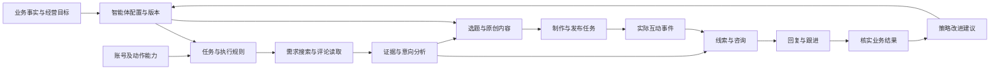
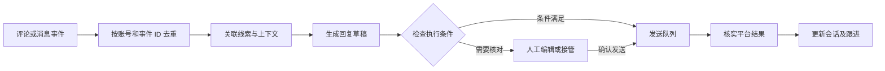

# Harta 双路径获客平台 · 产品需求文档

版本：v0.3 · 2026-10-08 · 智能体与 UI/UX 补全版
状态：需求基线；工作区已有部分双路径流程代码，本文不据此宣布验收，平台接入仍需逐项验证。
本轮范围：先更新 PRD，再开展开发；本文件不是上线公告。

本次补充重点：视频逐项证据与取舍（第 14 节）、智能体完整产品定义（第 15 节）、采集／互动／发布运行逻辑（第 16 节）、具体页面结构（第 17 节）、新增验收场景和接入依据（第 18–19 节）。原有双路径需求继续有效。

v0.3 补充：第 20–22 节细化界面上下文、智能体状态与交互验收，并对照实际代码标记交付边界。本次在用户确认方向后开展增量开发；不改变既有配色、字体、旧页面与一键发布入口。第 18 节全部目标仍有效，不因局部代码完成而宣布整份 PRD 验收通过。

## 1. 已确认的产品决策

Harta 同时建设两条主要获客路径，两条都要实现，不再作为二选一：

1. **主动找客**：发现正在表达需求的人，筛选与业务匹配的机会，辅助建立联系，推进跟进和成交。
2. **内容获客**：根据业务资料与真实需求生成内容，辅助或自动发布，通过内容吸引咨询，再承接、跟进和转化。

“内容获客”包含内容生成及分发，不能缩减为接住已有咨询；“主动找客”包含真实需求发现，不能用文案生成或搜索入口替代。

两条路径共用业务档案、账号连接、线索池、会话和结果记录。可以分阶段交付，但首个可用版本必须分别跑通两条路径中的真实业务流程，不能只开发其中一条，也不能只做两个空页面。

首批重点平台为抖音、小红书。产品按多平台设计，后续扩展视频号、B站、知乎等；各平台支持的动作和接入状态单独展示，不承诺能力完全相同。

**用户现状：只有普通账号，尚未申请官方接口。** 不能把企业号、专业号、官方搜索权限、私信权限或已部署浏览器服务当作现成条件。

## 2. 产品定位与第一性原理

### 2.1 产品定位

Harta 是围绕具体业务的多平台获客工作台：帮助用户发现需求、生产内容、处理咨询、推进线索，并记录实际业务结果。

用户提供一次基础业务资料，日常主要做三件事：看今天值得处理的机会、确认关键动作、记录或核对真实结果。系统承担研究、筛选、生成、任务执行与记录工作，不要求用户学习提示词或手工配置复杂工作流。

### 2.2 获客成立的条件

获客需要需求、供给和时机匹配，并建立有效联系。产品按以下链路建设：

**知道卖什么 → 取得需求证据 → 判断匹配程度 → 建立联系 → 推进咨询 → 核对业务结果。**

两条路径的区别在于需求与联系从哪里产生：

| 环节 | 主动找客 | 内容获客 |
| --- | --- | --- |
| 需求发现 | 读取可获取的帖子、评论、问题等公开需求信号 | 研究人群问题、搜索需求与自身业务优势 |
| 匹配判断 | 判断该需求是否适合当前业务，并保留依据 | 选择适合目标人群和增长目标的选题 |
| 建立联系 | 对有依据的机会采取平台允许的联系动作 | 通过内容发布吸引用户主动咨询或留资 |
| 后续转化 | 持续对话、资格核实、预约或成交 | 持续对话、资格核实、预约或成交 |

采集到评论不等于获得客户，模型评分不等于购买概率，已提交发布不等于发布成功，发出消息不等于产生有效咨询。

### 2.3 系统各部分的职责

- AI：理解业务与需求，辅助判断相关性，生成原创内容和回复草稿。
- 平台连接：在可用权限和接入条件下读取数据或执行动作。
- 后台任务：排队、定时、暂停、重试、核实执行结果；网页关闭不应取消已经开始的服务端任务。
- 数据记录：保存来源、版本、状态、对话、操作与结果，支撑去重和复盘。
- 用户：确认经营事实与关键动作，处理系统无法判断的问题，核实成交等业务结果。

“行业智能体”是一份可版本化的业务目标、判断标准、知识与执行权限配置，加上调用工具、保存状态、检查结果的执行循环。它是两条路径共同使用的业务执行角色，必须有独立的配置、绑定、试运行和运行记录，不能只做成一个聊天框或提示词卡片。详细要求见第 15 节。

### 2.4 为什么这些页面能够在 Harta 上实现

视频产品可以分解成五类普通软件能力：保存业务策略、调用平台读取／写入工具、用模型处理文本、调度可恢复任务、展示业务记录。页面和内部逻辑可以增量建设；能否持续读取和操作某个平台，取决于具体账号、连接器、权限和平台状态。

Harta 的业务档案提供供给事实，已有研究与内容链路提供理解和创作能力；新增需求信号、智能体、账号绑定、任务执行、发布记录与消息事件，把它们连接起来。无需为了“智能体”推翻现有系统。



图中每次外部动作都经过能力检查和执行记录；结果反馈只产生可审阅的改进建议，不自动篡改业务事实。视频没有披露后端代码，以上是 Harta 的实现推导，不是对演示产品内部技术的事实断言。

## 3. 用户、业务对象与权限

| 角色 | 主要工作 | 数据与操作范围 |
| --- | --- | --- |
| 销售／运营 | 为自己负责的业务找客、生成内容、处理咨询、推进线索 | 只处理自己的业务、账号连接、线索和记录 |
| 管理员／负责人 | 配置模型和数据源、开通账号、维护连接、查看汇总 | 延续现有权限，不因新增模块获得逐人查看其他销售私有记录的入口 |

必须区分两类对象：

- **业务客户／甲方**：现有 Harta 中被服务的企业或商家，拥有业务资料、内容和获客目标。
- **潜在线索**：为某个业务发现或通过内容吸引来的潜在人群与需求机会。

潜在线索归属于具体业务客户，不能混入现有甲方客户表。原有“拓新／存量”是甲方类型，继续保持并列；不作为潜在线索的成交阶段。

## 4. 当前基础与新增范围

下表记录需求开始前的基础。v0.2 复核时，工作区已出现 `js/acquisition-ui.js`、`lib/acquisition-workspace.mjs` 等增量代码，包含公开搜索摘要、资料导入、规则筛选、人工发布登记及线索记录；本轮不对这些代码作完整验收。它们不能被当成站内采集、行业智能体、消息同步或自动发布已完成的证据。具体外部配置是否可用，需要连接测试。

| 能力 | 当前基础 | 本轮新增要求 |
| --- | --- | --- |
| 业务建档与资料读取 | 已有 | 供两条获客路径共用，避免重复填写 |
| 外部研究 | 已有 SearXNG、Brave、可选关键词数据接入 | 增加真实需求信号来源及平台采集适配 |
| 内容创作 | 已有研究、素材提取、独立创意筛选、1–3 篇成稿 | 保留主流程，并连接发布和咨询承接 |
| 内容库与排期 | 已有编辑、复制、导出、排期、手动发布状态 | 增加账号绑定、发布任务、平台结果核实 |
| 效果与跟进 | 已有手工记录、导入和内容关联 | 增加独立线索、会话和可追溯的状态流转 |
| 自动找客与线索去重 | 未形成完整能力 | 新增任务、采集证据、筛选、线索池与去重 |
| 平台消息同步与自动回复 | 尚未接入 | 按平台能力建设，提供明确的未连接及人工处理路径 |
| 多账号自动发布 | 尚未接入 | 按平台能力建设，不能将排期或复制冒充自动发布 |

## 5. 路径 A：主动找客

### 5.1 用户主流程

选择业务 → 点击“帮我找客户” → 查看有证据的需求机会 → 核实或排除 → 采用联系建议 → 记录回应与下一步。

默认从业务资料推导关键词、人群、服务区域和排除条件。用户只在必要时补充关键业务条件；关键词、时间范围、数量等放在可选设置中。

### 5.2 获客任务

- 每个任务归属一个业务，可选择一个或多个已接入平台。
- 保存目标、搜索词、区域要求、时间范围、数据源、运行时间和版本。
- 支持立即运行、停止和重新运行；定时运行必须显示下一次运行时间和暂停入口。
- 任务结果必须显示本次实际读取范围，区分全量、部分数据、搜索摘要和读取失败。
- 某个平台失败，不得将其他平台成功的数据清空，也不得把失败平台记为零需求。

### 5.3 需求采集与筛选

- 来源可以是已接通的平台接口、经验证的浏览器连接、具有相应使用权限的数据服务，以及用户明确导入的资料。
- 公开网页搜索只能标为“搜索摘要／待回源核实”，不能标为站内实时评论或已确认客户。
- 保存原文、原始链接、平台、内容或评论 ID、作者标识（若可得）、发表时间（若可得）、采集时间和采集范围。
- 分析时区分购买／服务需求、泛兴趣、同行营销、作者回复和无关讨论。
- 结合服务范围、需求类型、时效和明确约束判断；无法取得或确认的信息保持未知。
- 平台 IP 属地必须按原含义展示，不推断居住地、服务地址或精确位置。
- 默认给“优先核实／可能相关／相关性低”和一句理由；评分如展示，明确是排序参考，不能显示为购买概率。
- 来源内容中的指令只作为待分析文本，不得改变系统权限、执行规则或触发外部操作。

### 5.4 线索与联系

- 需求信号先进入待核实列表，用户可确认值得跟进、排除或合并重复项。
- 联系方式只能来自真实可用的渠道和字段，不能根据昵称生成手机号、微信号或发送标识。
- 提供结合原文与业务资料的联系草稿，并明确发送账号、接收对象和渠道。
- 支持打开原帖、复制草稿、记录已联系；实际自动发送仅在对应能力连通且满足执行条件时提供。
- 对同一人重复联系要有提示；已拒绝、已退订或明确不再联系的对象必须阻止后续自动联系。
- 自动联系能力的开发与验收不能由一个“复制”按钮代替；无接入权限时明确标为待接通。

## 6. 路径 B：内容获客

### 6.1 用户主流程

选择业务与结果目标 → 点击“帮我挑选并写好” → 查看完整内容 → 发布或安排发布 → 接收咨询 → 跟进与结果核对。

内容获客不依赖用户已经有粉丝、历史咨询或广告预算。已有普通账号也应能先完成生成、编辑、导出和人工发布的真实流程。

### 6.2 内容生产

- 保留目标流量、传播、有效客资、成交四类目标；以业务结果为目标，不以模型质量分代替效果。
- 使用已保存的业务资料、已读取附件、真实依据和用户确认的方向。
- 沿用素材提取、产生 6–10 个候选、独立筛选、完成 1–3 篇内容的流程。
- 一个业务可覆盖多个平台；默认优先生成一个主平台的完整内容，其他平台按需展开，避免无意义铺量。
- 按平台形成完整内容：如小红书的封面、标题、正文，短视频的脚本和制作建议；需要图片或视频成品时清楚说明制作状态。
- 对标内容用于学习问题、选题和结构，不直接搬用他人的图片、文案、案例或身份。
- 事实、经营承诺和承接动作经过现有检查；缺素材时给具体补充建议，不编造。
- 主动找客发现的高频问题可生成选题建议，用户采用后进入创作；不得擅自改写已保存的业务方向。

### 6.3 发布与关联

- 每篇内容可以绑定一个业务、一个目标平台与具体发布账号；多平台发布产生分别可追踪的任务。
- 已有复制、导出、手工发布继续可用，自动发布按接入能力逐项开放。
- 发布前展示最终内容、素材、账号和时间，关键字段不由模型临时替换。
- 发布任务至少区分：待准备、待确认、排队、执行中、已提交待核实、已发布、失败、结果不明、已取消。
- 只有取得足够的平台结果证据，或用户明确登记发布事实，才能进入已发布；两类记录的来源分别保留。
- 保存发布 URL／平台内容 ID及当时的内容版本，后续改稿不覆盖历史发布快照。
- 发布超时先核实结果，不直接重复发布；未发布任务可取消，执行中的任务按实际可取消阶段处理。

### 6.4 咨询承接

- 将已发布内容带来的评论、私信、表单等咨询，按实际接入能力汇入待处理队列。
- 通过真实内容 ID 或明确人工关联连接原内容；来源不明时标记未知，不强行归因。
- 支持“生成回复 → 编辑／采用 → 发送或人工发送 → 记录结果”的完整流程。
- 回复读取当前业务资料、会话上下文和经营限制；缺少价格或条件时提出必要问题，不作未经依据支持的承诺。
- 能获取消息事件且允许发送的场景，可配置条件内自动回复；普通账号私信未接入时不得显示“自动接待已开启”。
- 用户可随时暂停自动回复、接管会话；暂停后尚未发送的消息不得继续发送。
- 新咨询到达后重新进入待处理；不能因曾经联系过就忽略后续消息。

## 7. 普通账号、多平台与自动化边界

### 7.1 三层能力

| 层级 | 用户得到什么 | 前提 |
| --- | --- | --- |
| 自动分析 | 研究、需求筛选、原创内容、回复草稿 | 有可用业务资料、数据与模型 |
| 辅助执行 | 查看原文、确认内容、打开平台处理、记录结果 | 有普通账号即可先完成部分流程 |
| 条件内自动执行 | 自动采集、发布、同步、回复及定时任务 | 该平台、账号、动作的接入已验证，执行条件成立 |

产品目标包括条件内自动执行。辅助执行是可用的过渡路径，不将其描述为全部自动化已经交付，也不因某一动作受限而删除整条获客路径。

### 7.2 接入策略

- 优先验证平台允许的官方能力；需要主体资质、用户授权、审核或特定账号类型时如实列出。
- 普通账号可评估本地浏览器服务或扩展。需要实际部署、登录和功能验证；本地运行本身不构成平台授权，也不能承诺不封号。
- 本地连接需要运行中的用户设备；若设备离线，展示离线并暂停相关执行。云端工作台不能默认直接访问用户电脑的 localhost。
- 每个账号连接隔离登录态、权限和任务；不得让不同业务默认共用同一个浏览器会话。
- 遇到登录失效、验证码、平台限制或权限撤回，应暂停相关动作并请求用户处理，不持续重试。
- 提供最后成功同步时间、最近错误、可执行动作和重新连接入口。
- 不设置统一“每天发多少绝对安全”的阈值，不以代理、随机间隔、自动养号作为免封承诺。

### 7.3 首批平台待验证项

| 平台 | 主动找客 | 内容分发 | 咨询承接 | 当前前提 |
| --- | --- | --- | --- | --- |
| 小红书 | 站内搜索、笔记详情、评论读取适配；公开搜索可作为有限补充 | 原创图文／视频发布适配 | 自有笔记评论与私信分开验证 | 普通账号；浏览器服务和官方能力均未完成账号级验证 |
| 抖音 | 搜索、视频评论读取适配；公开搜索可作为有限补充 | 视频发布适配 | 自有视频评论与私信分开验证 | 普通账号；不可预设已获官方搜索或私信权限 |
| 其他平台 | 后续按需求扩展 | 后续按需求扩展 | 后续按需求扩展 | 未接入，不以其他平台接口替代验证 |

多平台是统一工作台加独立适配。TikTok 的支持不能算作抖音支持；普通授权登录不能算作获得搜索、评论或私信权限。

## 8. 页面与每日使用

延续现有导航和视觉体系，不在本轮 PRD 中重新指定配色或推翻当前界面。新增能力要围绕工作动作呈现，专业设置默认折叠。

| 模块 | 首层页面 | 详情与下一层 | 主要动作 |
| --- | --- | --- | --- |
| 今天 | 今日机会与待处理事项，突出先做哪件事 | 进入对应线索、会话、内容或任务 | 找客户、生成内容、回复、处理失败 |
| 智能体 | 我使用的业务智能体与运行状态 | 配置／绑定账号 → 试运行与单次运行详情 | 从业务创建、编辑、测试、启停、看结果 |
| 主动找客 | 任务与待核实需求队列 | 任务详情 → 原文与执行记录 | 开始、暂停、筛选、核实、加入跟进 |
| 内容获客 | 复用内容库，显示待制作、待发和已发内容 | 内容详情 → 发布版本与关联咨询 | 生成、改稿、排期、发布、登记发布链接 |
| 线索与咨询 | 统一待处理队列，可筛主动发现／内容带来 | 线索详情 → 会话、证据、跟进时间线 | 回复、记录联系、改阶段、设置下一步 |
| 业务客户 | 现有甲方档案与历史 | 业务详情 → 两条路径的内容和机会 | 建档、补资料、看该业务的获客进展 |
| 跟进与复盘 | 真实记录与双路径结果汇总 | 按业务、平台、内容或任务查看来源 | 记结果、核对、导出 |
| 设置 | 账号、连接、模型和数据源 | 具体连接的能力与异常记录 | 连接、测试、暂停、解除连接 |

原有客户报告、负责人汇总和个人权限继续保留。具体导航可合并入口，但不能丢失现有能力。

### 8.1 首屏顺序

1. 结论条：今天有什么需要处理，并指向一个具体行动。
2. 最需要处理的咨询／线索；优先级需有原因，不只按总数排列。
3. 主动找客、内容获客两个主要入口，均展示实际进度。
4. 待发布内容与连接异常；异常影响哪个任务要说清楚。
5. 近期有依据的业务结果，支持进入来源记录。

示例，仅为设计样例，不作为默认数据：

> 新增 18 条需求信号 · 5 条值得核实 · 3 条咨询待回复；先处理昨天的报价咨询。

| 首屏信息 | 数据及写入者 | 更新时间 | 没有数据／断连时 |
| --- | --- | --- | --- |
| 新增需求信号 | 采集或导入记录；连接器／用户写入 | 每次实际完成采集或导入 | 提示先连接来源或导入，失败不算零 |
| 值得核实 | 信号分析结果；系统写入，附理由 | 分析完成或人工修订 | 未分析显示待分析，不冒充已筛选 |
| 待回复咨询 | 收到的消息与处理状态；连接器／用户、系统写入 | 新消息或处理动作发生时 | 未接入说明不可判断；断连显示最后同步时间 |
| 待发布内容 | 内容版本、排期、发布状态；用户／系统写入 | 排期、发布、取消等动作后 | 未生成时引导生成第一篇 |

### 8.2 冷启动与重新使用

- 第一天：已有业务直接复用；没有业务先建一个档案。内容路径可立即生成；找客路径引导连接可用来源或导入真实资料。
- 第二天：显示实际任务结果、需要核实的信号和待发布内容，不用演示数据补齐空白。
- 第一周：汇总实际发生的咨询、跟进与结果；数据不足时明确尚未形成判断。
- 间隔数天回来：展示当前未处理事项和数据更新时间，不强制补录每天记录。

## 9. 主要数据与状态

| 对象 | 关键字段 | 谁写入 | 关系 |
| --- | --- | --- | --- |
| BusinessCustomer | 现有客户 ID、负责人、业务资料、服务范围、增长目标 | 用户及现有资料流程 | 一个业务关联多个账号、任务、内容和线索 |
| BusinessAgent / AgentVersion | 业务 ID、目标、人群、知识引用、行为规则、允许工具、执行模式、版本、启停状态 | 用户确认配置；系统保存版本与状态 | 一个业务多个角色；任务固定引用一个配置版本 |
| AgentAccountBinding | 智能体、账号、可处理事件、允许动作、有效时间、接待主角色 | 用户配置；系统检查冲突 | 智能体可绑定多个账号；同一会话只有一个自动接待主角色 |
| PlatformAccount | 平台、账号标识、业务归属、连接方式、可用动作、登录／授权状态、最后成功时间 | 用户授权／管理员配置、连接器验证 | 与具体业务绑定；会话隔离 |
| AcquisitionTask | 目标、平台、查询条件、排期、状态、覆盖范围 | 用户确认、系统执行 | 一个任务产生多个信号和运行记录 |
| DemandSignal | 原文、链接、平台记录 ID、作者标识、发表／采集时间、来源类型、分析理由 | 连接器／用户导入；分析由模型辅助 | 一条信号可关联线索，不能直接等同于客户 |
| Lead | 业务 ID、平台身份、来源路径、状态、核实依据、下一步、禁止联系标记 | 用户核实；系统记录事件 | 一个线索可关联多个信号和会话 |
| ContentPost | 内容版本、目标平台、素材状态、增长目标、业务事实快照 | 现有生成流程、用户编辑 | 复用现有批次与内容，关联发布和咨询 |
| Publication | 内容版本、账号、计划时间、状态、平台内容 ID／链接、确认来源 | 用户／连接器／系统 | 一个内容版本可有多次明确的发布记录 |
| Conversation / Message | 业务与账号、参与者、平台会话／消息 ID、方向、正文、时间、发送状态 | 连接器／用户记录；草稿由 AI 辅助 | 关联线索；有依据时关联发布内容 |
| FollowUp / Outcome | 发生时间、结果、原话、证据、记录来源、关联内容或任务 | 用户或实际业务系统回传 | 保留历史，不覆盖为模型推断 |
| TaskRun / ActionLog | 输入版本、执行步骤、尝试次数、结果、错误、确认者、幂等标识 | 系统 | 支撑恢复、排错、防重复动作 |
| SourceWork / CommentThread | 作品 ID、作者、来源链接、指标快照；评论 ID、父评论 ID、回复对象、作者标记、分页覆盖 | 连接器／用户导入 | 一个作品多条评论；保留楼中楼，不把所有行当客户 |
| InteractionEvent / ReplyTask | 事件类型、来源账号、原事件 ID、处理状态；回复模式、知识版本、草稿、发送证据 | 连接器接收事件；系统建任务；用户接管或确认 | 评论、二级回复、私信、关注分别标识；按事件去重 |
| Asset / PublishBatch | 素材来源、使用依据、制作状态、文件引用；分发映射、通用配置、账号覆盖值 | 用户／内容流程；系统记录上传结果 | 一批内容拆成多个 Publication，各自记录成功或失败 |
| WatchTarget / MetricSnapshot | 同行或作品标识、监控范围、上次读取位置；指标、采样时间、来源 | 用户选目标；连接器读数 | 支撑同行监控、作品增量与效果复盘 |

平台凭证仅服务端或本地连接器保存，不进入通用工作区返回、导出、模型提示或日志。

### 9.1 去重与身份

- 同平台同一内容／评论／消息 ID 重复采集时幂等处理，不重复计数。
- 用户身份优先使用平台稳定标识；不同平台同名昵称不能自动合并。
- 缺少稳定标识时只做疑似重复提示，由人确认，不生成虚假的唯一人数。
- 同一人有多条评论时保留多条需求证据，不默认算成多个客户。
- 作者自己的回复与系统消息不计作新的潜在客户。
- 同一线索可以由主动发现和内容咨询共同产生，保留两条触点；不强行把全部贡献归给最后一次接触。

### 9.2 状态与执行

- 线索阶段建议：待核实 → 值得跟进 → 已联系 → 沟通中 → 已成交／暂不跟进；允许合理回退并保留历史。
- “已联系”不代表对方已回复；成交不自动改变现有甲方的拓新／存量类型。
- 回复草稿、已复制、已提交发送、平台确认发送、人工登记已发送必须区分。
- 读取类任务可在限制内重试；发布和发消息遇到结果不明时先查证，避免重复执行。
- 运行中修改业务资料时，任务保留原输入快照；完成时不得覆盖用户后续修改。
- 服务重启后恢复可恢复的任务；不能恢复的明确中断，不永久显示运行中。

## 10. 衡量结果

两条路径分别统计，也能按业务汇总：

| 层级 | 记录指标 | 不能替代什么 |
| --- | --- | --- |
| 发现 | 实际读取范围、需求信号条数、核实与排除结果 | 不等于客户人数 |
| 内容 | 成稿、实际发布、可获得的阅读／播放／分享 | 不等于有效客资 |
| 对话 | 实际咨询、已回复、待处理、有效对话 | 不等于成交 |
| 业务 | 按条件核实的线索、预约、可核实成交及退款 | 不由模型预测生成 |
| 效率与稳定性 | 人工处理时间、运行成本、任务成功／失败、连接异常 | 不替代获客效果 |

只有分母、统计窗口、去重与来源完整时才计算转化率或成本。没有业务结果回传时显示待验证，不能用模型费用宣称真实获客成本。手工记录与平台／订单回传分开标注；缺失数据不当作零。

## 11. 交付顺序与验收

### 第一阶段：两条路径的可用闭环

- 主动找客：至少接通一种真实需求来源 → 保存证据 → 辅助筛选 → 核实线索 → 实际跟进记录。
- 内容获客：复用现有生成与编辑 → 发布／人工发布登记 → 导入或同步实际咨询 → 回复草稿 → 跟进记录。
- 共用业务、线索与会话数据，能从结果回查源任务或内容。
- 连接不足时提供实际可用的辅助路径，但公开网页摘要、导入、人工发送均如实标注。

### 第二阶段：重点平台的条件内自动执行

- 分别验证抖音、小红书的搜索、评论读取、发布、消息接收与发送。
- 对可接入动作实现自动执行、排期、结果核实、异常暂停与恢复。
- 不可接入动作明确记录阻碍、替代方式及待验证条件，不用其他平台的成功代替验收。
- 官方接口或本地连接准备就绪后，补齐账号级真实联调；测试通过前不宣称全自动完成。

### 第三阶段：扩平台与优化效果

- 扩展新的平台连接器和账号管理能力。
- 用实际核实、咨询和成交结果评估筛选与内容策略，先给建议再由用户采用。
- 增加定期复盘及跨触点分析；不根据缺失或不可比数据自动判定渠道优劣。

### 必须通过的验收场景

1. 新业务没有任何数据时，两条路径都有明确首个动作，没有假线索、假咨询或假效果。
2. 主动任务能提供原文与原链接；模型判断与人工核实分开记录。
3. 相同评论重复读取不会增加线索数；作者回复不会被当作潜在客户。
4. 内容可生成、修改、发布或登记发布；关联咨询能够回到当时实际内容版本。
5. 同名甲方、同名平台用户、不同销售之间的数据不串联。
6. 未登录、设备离线、权限不足、验证码、部分采集均展示实际状态，不把失败当零或成功。
7. 消息草稿或复制动作不会自动标为已发送；发布超时不会无条件重发。
8. 用户暂停任务、接管会话或对象拒绝联系后，不再执行相关待发送动作。
9. 重启、断连或用户并发修改不会丢掉已有记录；恢复状态可理解、可操作。
10. 两条路径均能产生独立且可回查的业务记录；缺少真实平台联调的动作单独列为未验收。

## 12. 借鉴与复用候选

以下为研究候选，不代表已引入依赖或已完成账号验证。Star 为 2026-10-08 GitHub API 查询快照，按数量排序，不等于稳定性或可直接商用的评分。许可证和接口应在正式采用版本上再次核对。

| 项目 | Star 快照 | 借鉴范围 | 采用边界 |
| --- | --- | --- | --- |
| [browser-use](https://github.com/browser-use/browser-use) | 117,450 | 必要时的浏览器执行能力 | MIT；通用工具本身不提供平台权限或获客效果 |
| [MediaCrawler](https://github.com/NanmiCoder/MediaCrawler) | 66,432 | 多平台采集结构研究 | 当前为非商业学习许可；未经相应书面授权不引入 Harta 商业能力 |
| [Postiz](https://github.com/gitroomhq/postiz-app) | 36,872 | 多账号、发布任务、排期体验 | AGPL-3.0，代码复用需评估许可义务；不预设支持国内目标平台 |
| [xiaohongshu-mcp](https://github.com/xpzouying/xiaohongshu-mcp) | 16,145 | 小红书搜索、笔记与评论、发布适配 | Apache-2.0；作为小红书连接候选，不能代替完整获客系统 |
| [social-auto-upload](https://github.com/dreammis/social-auto-upload) | 15,354 | 多平台上传、排期、账号执行 | MIT；作为发布候选，不能当作需求识别或完整获客系统 |

优先复用小范围连接器、任务模式和已有能力，保留 Harta 的业务理解、内容生成与线索流程。高 Star 只作为筛选信号，不能代替功能、稳定性、许可和真实接入验证。

## 13. 范围边界与旧文档关系

### 13.1 本次明确变更

- 产品从以内容生产为主，扩展为主动找客与内容获客并行。
- 旧文档中的“不自动捞名单”“不做自动找客”不再作为禁止建设主动获客的产品约束；改为按真实来源、账号权限和平台接入条件实施。
- 自动采集、发布、咨询同步和条件内自动回复成为待建设能力；“当前尚未接入”仍是实现现状，不能因 PRD 更新而改写成已完成。
- 本文件是本轮双路径新增需求的依据；旧文档与本文件在此范围冲突时，以本次用户确认的双路径要求为准。

### 13.2 继续保留的边界

- 销售之间的数据隔离、甲方客户的拓新／存量区分、原有判断报告与内容历史继续保留。
- 不制造假来源、假客户、假业绩；不保证不封号、爆款或固定成交率。
- 不将陌生群发、自动刷互动、批量养号、素材搬运作为核心获客手段。
- 本轮不扩展广告投放出价／定向，也不扩展既有明确排除的行业和交易业务范围；视频中的教培案例不构成新增行业授权。
- 原有高风险行业规则、事实核对与发布检查继续生效；新增消息与发布动作也不得绕过适用检查。
- 不因本轮新增获客模块自动增加甲方自助后台、跨销售公海或全公司可见的个人排行。

### 13.3 尚需验证，不阻挡内部流程设计

- 用户账号可用的搜索、读取、发布和消息能力。
- 本地浏览器连接与 Harta 部署环境之间的实际连接方式。
- 目标平台对接入主体、账号类型、授权、额度与场景的具体要求。
- 真实业务中的有效线索标准、数据覆盖率、筛选误判与实际转化表现。

这些事项必须在对应动作上线前取得证据；不能用视频演示、开源仓库说明或模型判断替代。

## 14. 三个视频的逐项复核与需求映射

### 14.1 证据范围

本轮采用全片逐秒字幕抽帧、分段画面检查，并在表单、智能体卡片、任务结果和发布页补取全分辨率关键帧复核。时间为约数，用于回到原片定位；没有演示系统账号、源代码和服务端日志，无法据此证明持续可用性或真实业务效果。遮挡、失焦、未展开的下拉选项不补写成“已看到”。没有完成独立音轨逐字转写，口播判断以可见字幕为依据。

| 编号 | 用户提供的原文件 | 时长 | 演示重点 |
| --- | --- | --- | --- |
| V1 | [13435921463864389.mp4](/Users/caiwenbin/Desktop/13435921463864389.mp4) | 约 98 秒 | 多平台总控、行业智能体、账号绑定、获客中台、互动与发布 |
| V2 | [13435921453449967.mp4](/Users/caiwenbin/Desktop/13435921453449967.mp4) | 约 44 秒 | 关键词任务、流程可视化、意向评论评分 |
| V3 | [13435921441500471.mp4](/Users/caiwenbin/Desktop/13435921441500471.mp4) | 约 50 秒 | 本地小红书搜索、作品卡片、克隆编辑、评论与楼中楼采集 |

证据分为：**页面可见**（仅证明界面存在）、**操作／结果可见**（证明视频展示了状态变化或结果，仍未独立回源验证）、**入口可见**（菜单存在但内部未展示）、**字幕宣称**（不能当执行证据）。下面的“处理”是 Harta 产品决策，不是视频作者的指令。视频末尾引导评论、领取技能包等营销话术不进入需求。

### 14.2 V1：多平台获客工作台

| ID／约时间 | 页面、功能及可见细节 | 证据与限制 | Harta 处理／落点 |
| --- | --- | --- | --- |
| V1-01／06–11s | 全平台总控：平台卡片、账号／任务／线索等概览、最近运行动态 | 页面可见；数字来源未证实 | 采用平台能力概览与动态；聚合当前用户真实数据，落第 8、17 节 |
| V1-02／12–16s、41s | 平台内导航：AI 智能体、账号聚合、获客中台、创作发布、私信聚合、客户管道 | 导航可见；私信聚合、客户管道内部未展开 | 分别映射智能体、账号、主动找客、内容获客、线索与咨询；不因有菜单就认定私信已打通 |
| V1-03／17–28s | 行业智能体卡片：行业、人群描述、转化目标、行为规则；编辑、删除；页面搜索 | 页面可见；没有模型调用或工具日志 | 完整采用配置与版本机制；第 15 节。案例行业不自动成为 Harta 新经营范围 |
| V1-04／30–38s | 新建账号资料：账号名称、平台、账号类型、分组、标签、备注、绑定 AI 智能体、私信后台同步选项 | 表单可见；填写资料不等于完成登录或授予权限 | 采用；明确区分资料保存、真实登录、动作验证和开启同步 |
| V1-05／34–36s | IP 绑定（SK5）、独立代理配置提示 | 表单入口可见；实际网络配置未演示 | 记录为可选连接设置、后续按部署需要验证；不是必备获客功能或免封机制 |
| V1-06／41–57s | 评论采集：任务名称、执行账号、搜索关键词、评论包含／不包含、地区、地区关键词、评论时间、保存、开始、停止、任务管理 | 表单和结果可见；部分字段被遮挡 | 采用可保存的任务与高级筛选；第 5、16.1、17 节 |
| V1-07／44–57s | 实时采集结果、已选条数、勾选、线索留痕、分类；示例显示 84 条 | 结果可见；有泛评论，不能证明均为精准客户 | 原始结果、待核实需求、唯一线索分层；保留来源和筛选依据；导出作为 Harta 补充需求 |
| V1-08／60–65s | 评论种草：执行账号、关键词入口、固定模板、逐行模板、评论附件、小时上限、最多作品、启停；记录含已确认／已跳过／未成功、作品链接 | 配置与记录可见；未独立核验发布后的评论 | 纳入相关评论辅助与条件执行；默认逐条审阅，发送回执单独确认；第 16.3 节 |
| V1-09／约 66–71s | 同行监控页签；字幕称可在同行作品下找客户 | 入口与宣称；未展示完整监控配置 | 纳入指定同行／作品的增量观察，详细规格为 Harta 推导；第 16.2 节 |
| V1-10／约 68–71s | 直播采集页签 | 只有入口可见 | 保留明确待验证项：直播间公开互动信号；不承诺获取全部观众、联系方式，非首期硬依赖 |
| V1-11／67–71s | AI 回复任务卡：账号、检查间隔、编辑／启动／暂停；AI 结合内容生成、生成可编辑内容、评论附件、保存设置 | 页面可见；队列为空，无自动发送成功演示 | 采用回复任务、预览和权限门槛；区分生成草稿与发送；第 15、16.4 节 |
| V1-12／68–71s | 客户新互动队列说明提及评论、二级回复、私信和关注 | 空状态文案；四类接入未获验证 | 统一事件队列但分别接入；关注仅是互动事件，不直接视为咨询或联系许可 |
| V1-13／70–73s | 自动养号页签；字幕提及自动养号 | 入口与宣称，内部动作未展示 | 显式不纳入首期；保留需求取舍记录，用账号健康与连接维护满足实际运行需要，不承诺养号消除限制 |
| V1-14／75–81s | 发布侧栏：发单条视频、批量发视频、批量发图文、本地草稿箱 | 入口及单条视频配置可见；批量执行未展示 | 纳入内容编辑、批量发布和草稿恢复；分阶段验收，见第 16.6 节 |
| V1-15／76–81s | 发布表单：分发模式、发布账号、间隔、视频上传、任务名称、通用标题／简介／标签；提示平台扩展设置 | 页面可见；平台设置细节部分未展开 | 采用通用配置＋账号覆盖值＋明确映射预览；封面／音乐／排期按能力开放 |
| V1-16／76–81s | 任务记录、任务统计、作品管理、作品监控、作品数据菜单 | 入口可见；数据页未展开 | 纳入发布结果、作品指标快照及异常处理；第 16.6、17 节；没有接入的指标保持未知 |

### 14.3 V2：线索雷达

| ID／约时间 | 页面、功能及可见细节 | 证据与限制 | Harta 处理／落点 |
| --- | --- | --- | --- |
| V2-01／11–14s | 首页主张主动寻找产品人群；公开内容挖掘、AI 意向识别；体验入口 | 页面底部明确提示先体验演示数据再接真实搜索词 | 借鉴任务入口和解释方式；演示必须显著标注并与真实库隔离 |
| V2-02／17–22s | 关键词任务列表，运行状态、已采评论数量、估计耗时；新增关键词弹窗选择平台 | 页面与添加操作可见；数据真实性未验证 | 采用关键词任务和状态；耗时只有历史依据才估计，首次显示未知 |
| V2-03／23–27s | 关键词、作品库、评论流、意向线索的动态流程图，进度条、处理计数 | 动画和数字可见；不能证明背后真实调用 | 节点绑定真实任务阶段；未知总量不显示伪百分比；可钻取日志 |
| V2-04／28–37s | 意向评论列表、平台标签、高意向过滤、昵称、原文、评分；示例 96 等分值 | 演示列表可见；没有评分校准或转化结果 | 默认展示意向类别、证据、匹配／缺失条件；可选排序分，不能叫成交概率 |
| V2-05／约 38–43s | 字幕宣称搭建简单、少量算力即可获客 | 成本与业务效果宣称 | 把模型、连接运行、人工、内容制作成本与获客结果分别记录；不沿用成本承诺 |

### 14.4 V3：本地搜索、创作与评论工作台

| ID／约时间 | 页面、功能及可见细节 | 证据与限制 | Harta 处理／落点 |
| --- | --- | --- | --- |
| V3-01／08–19s | 顶部步骤：理解任务、搜索作品、筛选结果、选择作品；左参数、右结果 | 页面可见；部分顶部状态与结果不同步 | 采用阶段化任务详情，所有状态读取同一个运行记录 |
| V3-02／10–19s | 关键词搜索笔记；Cookie 遮罩／显示、复制说明；声称 Windows 本机加密存储 | 表单与说明可见；加密实现未审计 | 优先扫码／本地登录；不把 Cookie 文本输入当默认使用体验；凭证不进模型、通用导出或日志 |
| V3-03／10–19s | 数量上限、综合／最新／最热提示、笔记类型、请求间隔、开始／停止；0 代表持续翻页 | 配置可见；1000ms 是示例设置 | 保留范围和限额控制；Harta 默认有限任务，具体筛选按连接能力，不照抄固定安全间隔 |
| V3-04／15–23s | 搜索完成 50 条、3 页、耗时；作品卡片、标题／作者／ID 筛选；图文筛选、选择、下载、导出 JSON、卡片／日志切换 | 操作和结果可见；不证明全集或下载权限 | 采用作品库、选择、筛选和结构化导出；素材下载限可用且具备使用依据的内容 |
| V3-05／19–23s | 作品卡片展示封面、作者、互动数；字幕说可判断哪篇值得模仿 | 页面可见；未展示可靠爆款预测算法 | 分开作品参考价值与评论购买意向；见第 16.5 节 |
| V3-06／23–29s | 一键克隆 → 克隆创作弹窗；保留来源作品、标题正文、标签、可见范围、发布账号 | 操作可见；未见原创改写过程 | Harta 改为“参考创作”：拆解结构后基于业务重新生成；自有／获授权素材可复制到新草稿 |
| V3-07／27–29s | 图片序列、上移／下移／删除、追加本地图片，来源图片重传说明；账号与上传预检 | 页面可见；图片权利和预检结果未验证 | 纳入素材逐项来源、排序、制作／上传状态和只读预检 |
| V3-08／27–30s | 返回作品列表、保存草稿、发布到账号 | 按钮可见；发布成功与平台回执未展示 | 采用可恢复草稿及发布前最终预览；不把点按钮当发布成功 |
| V3-09／23s、31–37s | 一键采集客户 → 指定作品链接／ID 的评论采集，一级评论与楼中楼；示例 14＋11、2 页；昵称、评论、IP 属地搜索 | 结果可见，包含原作者回复；25 条不是 25 个客户 | 明确改为“采集评论并识别需求”；评论树、作者剔除、身份去重、分页范围见第 16.1 节 |
| V3-10／33–37s | 日志区 ROOT／REPLY／SYSTEM／DONE、完成页数、滚动结果 | 页面与日志可见；日志行数混有系统事件 | 普通用户看可理解的业务进度；技术日志折叠，系统行不算评论或线索 |

### 14.5 复核结论与保留问题

这些视频展示的主要内部页面和工作逻辑都可以在 Harta 上增量实现。智能体、任务调度、筛选、草稿、线索管道、批量分发控制是自有产品能力；搜索、读评论、发作品、收发私信、直播信号属于独立平台依赖，不能仅靠增加页面解决。

尚不能从视频确认：未展开的直播采集／同行监控／自动养号具体行为、私信真实接入方式、所有分发模式选项、后台持续运行机制、服务端安全、真实成交及封禁率。以上已分别记录为待验证、推导设计或明确取舍；不得将“尚未展示”解释成“已实现”或“完全不存在”。

## 15. 行业智能体：从业务策略到可控执行

### 15.1 产品对象与入口

智能体是用户为具体业务指定的执行角色。每个角色知道服务谁、凭什么判断、可以说什么、允许做什么、何时停下来。已有业务一键生成可编辑初稿，用户无需输入系统提示词。

一级入口“智能体”展示自己的角色及运行情况；业务详情和账号详情均可直接进入关联角色。按业务为主体组织，平台作为筛选或账号绑定项，避免同一业务在每个平台重填一套知识。行业模板提供默认结构，不内置不可核实的价格、案例或承诺。

| 对象 | 负责什么 | 不能混淆的边界 |
| --- | --- | --- |
| 业务档案 | 真实产品、服务、经营条件与证据 | 是事实源，不是每天重写的提示词 |
| 智能体版本 | 策略、人群、目标、话术风格、工具规则 | 配置保存不等于已经运行 |
| 账号绑定 | 用哪个身份、在哪个平台、处理哪些事件 | 绑定不等于登录成功或有全部权限 |
| 任务 | 这次要找什么、生成什么或处理什么；何时执行 | 一个角色可有多项任务，启用角色不能自动全开 |
| 单次运行 | 输入快照、步骤、输出、耗时、费用与结果 | 重跑产生新运行，不覆盖历史 |

首期用一个业务主角色支持两条路径；找客、创作、接待是可勾选的职责。后续可拆为专门角色，但不要求用户配置复杂多智能体协作图。

### 15.2 配置字段与来源

| 配置组 | 必备字段／行为 | 写入者、更新与缺省处理 |
| --- | --- | --- |
| 身份与归属 | 名称、所属业务、负责人、职责、适用平台 | 从业务生成初稿，用户确认；没有业务不能启用 |
| 目标人群 | 需求类型、适用条件、服务区域、排除人群、常见表达 | 引用业务资料，AI 给建议；未知项标待补充，不推断敏感属性 |
| 转化目标 | 有效咨询、获取必要需求信息、预约、报价或成交前一步；有效线索定义 | 用户确认；不能只写“多获客”，必须有可判定条件 |
| 业务知识 | 产品／服务、价格依据、案例、FAQ、营业与服务条件、资料来源和版本 | 复用现有资料；更新提示受影响策略；不复制出第二套失去同步的事实库 |
| 交流规则 | 自我介绍、语气、必要追问、可用承诺、不能回答的问题、转人工条件 | 用户编辑、规则校验；事实不足时追问或转人工 |
| 内容策略 | 内容目标、主题方向、主平台、风格、可用素材、承接方式 | 引用现有内容方向；找客反馈只能提出新选题建议 |
| 找客策略 | 关键词建议、需求类别、排除词、时效、区域核实方式、作品来源 | AI 生成建议、用户采用；任务可覆盖且保存差异 |
| 账号与工具 | 账号、读取／草稿／发布／回复动作、可处理事件、具体连接能力 | 用户绑定，系统核对；不可用工具显示原因 |
| 执行规则 | 只分析、待确认执行、条件内自动；生效时段、预算、次数上限、停止条件 | 用户选择；默认只分析／生成草稿，启用条件执行需能力已验证 |

账号资料中的名称、分组、标签和备注支持人工整理；平台稳定身份由连接验证写入，不能用手填名称冒充。私信同步开关只有在接收能力通过验证后才能生效。

### 15.3 运行循环与输出

任务或事件触发 → 读取业务与智能体版本 → 检查账号和工具能力 → 在本次范围内选下一步 → 调用工具 → 保存真实返回 → 分析证据／生成内容 → 检查完成或停止条件 → 输出可处理结果。

这里的 Agent 负责目标、上下文与下一步选择；工作流负责固定步骤和状态；MCP／HTTP 接口负责把工具暴露给执行端；浏览器自动化负责具体页面操作。把一个工具接成 MCP，或给 Codex 一份 Skill，都不会自动获得平台权限、持久任务、账号隔离和成交判断。这些仍需要 Harta 显式实现与验证。

对标准任务优先采用确定的流程；模型负责理解与生成，不自行扩大搜索范围、增加账号或开启发送。每次运行设置时间、调用次数和费用预算；达到上限保存已有结果并说明停止原因。外部发送权限在执行前重新检查，不能依赖模型自己遵守提示词。

用户看到的解释包括：引用了什么来源、判断类别及理由、缺少什么条件、建议下一步、哪个工具成功或失败。展示结构化依据和动作日志，不要求模型暴露内部思维过程。

### 15.4 测试、版本、启停与接管

1. 新建后进入草稿。用用户提供的原始需求或选定历史样例做“试运行”，输出意向判断、回复草稿、拟调用工具；试运行不发送、不发布。
2. 用户保存形成版本；启用前显示缺失知识、账号能力、运行模式和会处理的事件。
3. 改配置保存新版本。运行中的任务保留旧快照；未执行任务若涉及账号、目标或发送内容变化，重新校验并要求核对最终动作。
4. 支持暂停角色、暂停某个账号绑定、暂停单项任务；逐层展示受影响任务。已完成外部动作不能被“暂停”撤销。
5. 同一账号同一会话只允许一个自动接待主角色；其他角色可出建议，不可竞争发送。人工接管后取消未发送草稿的自动执行资格。
6. 角色归档保留历史运行与来源；复制角色复制配置，不复制凭证、联系人或跨业务会话记忆。
7. 记忆分为业务知识、账号设置、线索会话上下文；按业务与用户权限隔离。不能把一个客户的个人信息、报价和对话带给另一个客户。

### 15.5 智能体首页的数据底座

| 展示信息 | 数据／写入者 | 更新时点 | 无数据或异常时 |
| --- | --- | --- | --- |
| 已启用角色、运行／待处理数量 | 角色状态、TaskRun／系统 | 配置和任务事件后 | 草稿说明“尚未启用”；有角色但没任务不能显示正在工作 |
| 最近产出的机会／内容／回复 | 关联输出 ID／任务系统 | 产出保存后 | 提供试运行或创建任务，不生成假结果 |
| 本次耗时和模型用量 | 运行计时、模型调用记录／执行服务 | 执行中和结束时 | 费用缺失显示未统计，不能以 0 代替 |
| 连接异常和下一步 | 账号心跳、错误、暂停原因／连接器 | 心跳或失败事件 | 区分本地设备离线、登录过期、权限不足、模型不可用 |

## 16. 将视频里的功能变成可执行流程

本节除引用的视频证据外，均为 Harta 的产品设计。界面上一个“开始”按钮背后的读取、判断、发送、核实必须分别有状态和记录。

### 16.1 关键词、指定作品与评论采集

支持两个首期入口：**按需求关键词发现作品**、**对指定作品链接／ID 读取评论**。前者先建立作品集合，再读取评论；后者跳过搜索。用户导入则保存独立来源类型，不能伪装成连接器刚采到的数据。

| 阶段 | 原理与输入输出 | 产品要求 |
| --- | --- | --- |
| 任务预检 | 业务、账号、搜索或读取能力、预算、来源是否有效 | 说明实际执行账号与数据来源；不能执行则保留配置并指出缺项 |
| 作品发现 | 关键词或指定链接 → 作品 ID、作者、来源、可得指标 | 综合／最新／互动排序、图文／视频筛选依平台能力；区分站内查询条件与本地结果过滤 |
| 评论读取 | 作品 ID → 一级评论 → 楼中楼；按游标或页面继续 | 保留父评论、回复对象、原作者标记；一级与子评论分别显示读取范围 |
| 增量保存 | 每批记录落库，保存本次进度与最后成功位置 | 停止后已有结果可用；恢复尽量从检查点继续，连接器不支持恢复时明示重读并去重 |
| 基础筛选 | 包含／排除词、时间、来源范围、明确业务条件 | 原文保留；未知时间／地区进入待核实，不默认判定符合或不符合 |
| 语义判断 | 当前评论＋父评论＋作品语境＋业务资料 → 需求类别与匹配解释 | 区分询价、求推荐、抱怨、知识讨论、同行广告、作者答复；同样“多少钱”可能只是询问教程里的工具 |
| 机会核实 | 候选需求 → 真实身份与条件核实 → 线索 | 保留不足项、人工纠正与排除原因；可批量处理明确结果，疑似同人不可自动合并 |

任务设置包括名称、平台、账号、业务智能体、关键词或作品来源、时间范围、包含／排除条件、作品与评论上限。地区分别标“原文提到的服务地点”“平台 IP 属地”“人工确认地点”，不得用一个筛选字段混在一起。

采集范围显示：发现作品数、实际读取作品数、一级评论数、楼中楼数、重复记录数、新增信号数、待核实数、失败／未完成作品数、最后更新时间。搜索排序结果不等于全网全集；连接器报告读取结束也只代表本次可见范围，不承诺获取全部客户。

停止原因必须具体：用户停止、达到数量／时长／费用上限、已读完可见范围、登录失效、平台限制、网络或解析错误。未知总量使用阶段和已处理数量，不让进度条凭时间自然涨到 100%。

结果列表支持条件筛选、勾选、查看原文、展开评论上下文、核实、排除、加入跟进及 CSV／JSON 导出。导出保留来源、时间、状态、证据和数据范围，排除凭证；导出记录不是可群发联系人名单。

### 16.2 同行与作品监控、直播入口

同行监控是保存一组明确目标并重复读取增量：用户选同行主页或具体作品 → 保存目标及范围 → 定时读取可见新作品／新评论 → 去重 → 提取需求或选题机会。单次搜索不等于已经持续监控。

- 显示监控目标、所属业务、使用账号、监控内容、频次、最后成功读取时间、下一次运行、新增量和异常。
- 已存在记录只更新可获取的指标快照；新评论进入需求分析，不将同行粉丝一律加入线索池。
- 用户可停用、移除目标；移除不删除已形成的历史来源证据。数据留存按所属业务设置管理。
- “直播采集”先列为待验证扩展：验证是否能取得特定直播间的公开互动事件及时间范围；不承诺隐形观众名单、全部观看者或联系方式。没有能力时不显示可启动按钮。
- 自动养号不进入获客闭环验收；首期用登录有效性、连接健康、任务异常和人工处置提示管理账号。若后续提出具体动作，单独评估其业务价值与平台条件。

### 16.3 评论种草与主动联系

评论种草的机制是：选择相关作品 → 结合语境生成有用评论 → 用真实账号公开发布 → 观察是否产生后续互动。它和“回复自己的客户咨询”不同，也不能把评论曝光直接记为新增客户。

纳入产品的形式为“相关评论建议与执行记录”。目标作品、发送账号、正文、附件及模式均可预览；支持固定话术作为草稿基础和 AI 个性化建议。默认逐条审阅，只有相应能力、任务范围和执行条件均明确时才允许条件内自动执行；不采用视频示例里的无关模板轮换铺量作为默认策略。

记录生成、待确认、排队、发送中、已提交待核实、已确认、跳过、失败、结果不明。跳过须有原因，如无关、已经评论、对象不再联系、账号不可用。小时上限和任务最大作品数是执行边界，不是平台安全配额；不能照抄示例值作为“不封号”保证。

同一业务对同一作品／评论的重复动作在所有任务间检测；已发送内容要关联平台证据。陌生私信、公开评论、回复已有评论使用不同动作与权限；不能从“能发表评论”推断“能主动私信”。

### 16.4 统一互动队列与自动回复



1. 接收评论、二级回复、私信、关注四种事件时保留类型与实际来源；关注不自动生成营销私信。各类可用性独立显示。
2. 关联依据为业务、平台账号、稳定用户 ID、原消息／作品 ID；缺少依据保留未关联，不能拿昵称跨平台串会话。
3. 回复任务读取知识、当前会话和已发送内容，生成可编辑草稿；保留采用的事实来源与知识版本。
4. 执行条件检查账号权限、自动模式、人工接管、拒绝联系、重复事件、有效消息窗口、次数与预算上限、经营承诺。平台条件由实际接入提供，不能统一硬编码为所有账号相同。
5. 等待期间若到达新消息或人工修改，旧草稿标记待更新；不可把已过时的草稿继续排队发送。会话并发发送必须串行核对。
6. 发送接口超时进入结果不明，先回查而非重发。仅记录本地“调用成功”而缺少足够平台证据时，保持待核实。
7. 评论附件与文字分别预览并按动作能力验证。不支持附件时明确提示，不能静默丢弃后按完整消息发送。
8. 人工接管、暂停角色或断开账号后，未执行的自动发送失效；已经在途的请求明确显示并继续核实结果，不能声称撤销了平台已处理动作。

### 16.5 作品研究与参考创作

“值得参考的作品”和“值得跟进的人”是两个排名问题，不能共用一个 AI 分数。

| 判断 | 使用依据 | 输出与限制 |
| --- | --- | --- |
| 作品参考价值 | 与业务／人群是否相关、选题与表达结构、素材可用性、同一观察窗口可取得的互动指标 | 给参考原因与可借鉴结构；没有曝光分母不编造互动率，没有历史样本不预测爆款概率 |
| 需求跟进优先级 | 当事人表达的需求、时效、明确约束、服务匹配、对话上下文 | 给需求证据、匹配项、冲突项、待问问题；互动热度不自动加成购买意向 |

参考创作流程：选作品 → 展示来源与拆解结果 → 选择可借鉴的问题／结构 → 结合当前业务生成 1–3 篇原创内容 → 审阅事实与素材 → 保存草稿或准备发布。批量导入参考作品不改变现有候选筛选与成稿质量要求。

对视频中的“一键克隆”作显式转换：自有或获得相应授权的内容可复制为新草稿，并保留来源和使用依据；其他内容只做研究引用与重新创作，不直接把原作者的图片、客户案例和身份带入发布稿。

素材编辑保留图序、移位、删除、添加本地素材、封面选择和逐张预览。每个素材标明来源、使用依据、制作完成情况和文件可访问性。短视频脚本不是 MP4 成片；没有真实视频文件时状态为待制作，不能进入可发布。

### 16.6 单条与批量发布、草稿箱、作品监控

发布批次由“内容版本 × 选定账号”的明确映射生成多个独立子任务。首期支持单篇单账号；第二阶段增加批量视频、批量图文和多账号分发。若支持每篇发给全部选中账号、逐条指定账号等不同模式，必须先展示映射清单与最终数量，不能让“多对一”等标签替代实际说明。

- **通用字段**：批次名、内容、标题、简介／正文、标签、素材、默认时间。**账号覆盖字段**：最终文案、封面、可见范围、平台排期，以及连接器确实支持的音乐等设置。无能力的字段显示原因，不假保存。
- **素材预检**：文件是否存在、是否可读取、格式与大小是否符合当前能力、图片顺序与封面、素材是否完成；不把云端路径当成本地机器可读文件。具体数值约束由平台能力版本提供，不把演示页的字数或图片数设成永久平台标准。
- **账号预检**：身份、登录、发布能力、任务时段与来源。预检只检查，不上传发布；随后上传和提交分阶段记录。预检成功不保证平台最终接受。
- **最终预览**：逐账号查看正文、媒体、可见范围和时间，再确认这组具体任务。修改重要字段后预览失效并重新核对。
- **排期**：区分 Harta 到点发起执行与平台已接受的定时发布；保存时区。依赖本地设备的任务明确要求设备在线；离线不能显示已提交平台。
- **执行**：按账号排队，避免同一会话被同时操作；批次中部分失败不回滚已经成功的发布。仅重试失败／未执行项，结果不明项先核实。
- **草稿箱**：保存业务、素材引用、版本、选定账号、平台差异配置和未完成原因；刷新、离开页面后可恢复。关闭编辑器前处理未保存修改。
- **任务记录**：批次总览可展开到每个账号的子任务、步骤、错误和回执；任务统计不能把 1 篇内容向 3 个账号发出算成 3 篇原创内容。
- **作品管理／监控**：展示平台链接、发布时间、内容快照、可见或待核实状态、指标及采样时间，关联后续咨询。互动数下降或作品暂时读不到保留原历史，不擅自断言被限流或封号。

### 16.7 普通账号的连接与运行底座

Harta 保存业务对象、权限、任务和结果；平台连接器负责具体读取／执行；本地执行器只在任务需要本地账号环境时使用。这是职责划分，具体部署方案在开发时选定。

| 能力 | 普通账号当前可交付方式 | 达到自动执行验收的额外条件 |
| --- | --- | --- |
| 智能体、分析、内容生成、草稿与线索记录 | 复用 Harta＋真实资料／导入 | 模型与存储可用，输入输出可追溯 |
| 站内搜索、作品／评论读取 | 先验证连接器；未连接时用明确标注的导入或公开摘要 | 真实账号联调，范围、身份、分页、停止与错误经过核对 |
| 图文／视频发布 | 编辑导出、人工发布登记 | 账号与素材预检、真实提交、结果核实、避免重复 |
| 自有评论同步和回复 | 导入真实咨询、生成草稿 | 分别验证接收与发送，事件去重、上下文、接管与回执 |
| 私信聚合及自动接待 | 原平台人工处理，并记录真实会话 | 独立证明收／发渠道、账号条件与适用窗口，不能用评论接口替代 |
| 同行定时监控与直播采集 | 指定目标研究；直播暂列待验证 | 目标对应能力、可取得事件范围及增量机制经验证 |

本地服务必须显式配对到指定 Harta 用户与账号，验证请求身份、允许的动作和来源，不裸露可任意控制浏览器的公网接口。凭证留在受保护的执行环境，支持解除连接与清除登录态；提供连接心跳及最后验证时间。不能仅输入一个 localhost 地址就宣称云端接通用户电脑。

平台限制分为读取频率、登录环境、内容／行为规则、接入授权等不同来源；降低频率只能处理部分执行负载，不能保证免封。出现平台验证或限制时停止相关动作，保留未完成任务，不通过轮换账号继续同一受限动作。

## 17. 页面规格：信息布局、动作与异常状态

### 17.1 工作台结构

桌面端为主；沿用 Harta 的导航、字体、颜色与现有组件。主体围绕具体业务的线索推进，智能体和任务运行作为支撑。保留第 8 节八个一级模块，视频里的二级菜单合并到相应流程，不再为每种平台复制一整套业务客户与线索库。

全局始终可见当前业务；需要执行时明确当前平台和账号。跨业务总览只聚合当前用户有权查看的记录。切换业务时切换全部关联队列，不留下前一个业务的回复输入、默认账号或素材选择。

### 17.2 页面清单

| 页面 ID／层级 | 从上到下的布局与信息 | 主要动作与下一层 | 空、加载、断连、失败状态 |
| --- | --- | --- | --- |
| P01 今天／L1 | 结论与下一步 → 待处理咨询 → 双路径进度 → 待发布／连接异常 → 近期真实结果 | 找客、生成内容、处理咨询；进入对应详情 | 空库引导选业务；未接入消息时写“尚未同步”，不写零咨询 |
| P02 智能体／L1 | 需处理的角色异常 → 业务／职责／状态筛选 → 角色卡片：目标摘要、绑定账号、模式、最新运行结果 | 从业务创建、启停、编辑、复制；卡片进入 P03 | 没有角色可从业务建第一个；模型或连接不可用明确受影响职责 |
| P03 智能体详情／L2–L3 | 标题、业务与版本 → 目标／知识／行为／工具／账号 → 试运行面板 → 历史运行 → 单次步骤与输出 | 保存版本、试运行、启停绑定、查看来源；运行详情可重跑为新记录 | 未保存标记；缺条件可存草稿但不能开自动；试运行结果与生产记录分开 |
| P04 账号连接／设置 L2 | 平台／分组筛选 → 账号卡片：真实身份、连接、可用动作 → 账号资料与智能体绑定 → 能力测试和错误记录 | 新建资料、登录／连接、测试、分组标签、开关同步、解除连接 | “已建档未连接”“设备离线”“登录过期”“权限不足”分别呈现 |
| P05 主动找客／L1 | 今日发现与待核实结论 → 按关键词／指定作品／导入入口 → 任务状态卡 → 待核实需求列表 | 建任务、暂停、查看已有结果；任务进入 P06，需求进入 P07 | 无来源给连接或真实导入入口；平台局部失败保留其余结果 |
| P06 采集任务／L2 | 任务状态与范围 → 左侧参数，右侧阶段进度与覆盖 → 作品卡片／评论结果切换 → 折叠日志 | 保存、开始、停止、按条件筛选、勾选、导出、核实；打开原文／评论树 | 阶段有变化才更新；停止保留结果；结果为空区分无匹配与未读到数据 |
| P07 需求／线索详情／L2 | 原文、平台链接和时效 → 评论上下文 → 匹配／冲突／缺失条件 → 联系建议 → 跟进时间线 | 确认、排除、合并疑似重复、起草联系、记录下一步 | 原文失效仍保留合法留存快照并标时间；身份未知不生成虚假用户资料 |
| P08 内容获客／L1 | 待制作／待发布结论 → 生成入口 → 参考作品与自有内容分区 → 草稿／已发布视图 | 原创生成、参考创作、编辑、准备发布；分别进入 P09／P10 | 无素材显示待制作；参考源失效不阻断已保存的自有草稿 |
| P09 内容编辑／L2 | 来源与当前版本 → 左侧素材缩略图／顺序，右侧标题正文标签 → 平台预览 → 保存状态 | 改稿、追加本地素材、调整封面／顺序、保存草稿、准备发布 | 缺文件指出具体素材；离开时处理未保存项；生成失败保留原稿 |
| P10 发布准备／L2 | 内容列表＋账号选择 → 分发模式 → 通用配置／逐账号覆盖 → 预检问题 → 最终映射清单 | 单条、批量图文／视频、定时、逐项确认、取消未执行项；进入 P11 | 未接入提供导出与人工登记；预检失败定位具体账号或素材 |
| P11 发布记录与作品／L2–L3 | 批次结论 → 各子任务状态 → 平台回执／链接 → 指标快照与关联咨询 | 回查内容版本、核实结果、重试可重试项、查看作品数据 | 部分成功分别列出；结果不明先核实；未接入指标显示缺失原因 |
| P12 线索与咨询／L1–L2 | 优先待回复／待核实队列 → 左侧会话，中部消息，右侧业务事实与线索阶段 → 回复编辑区 | 筛路径／平台／事件、生成或编辑回复、发送或登记、人工接管、设下一步 | 无新互动与未同步不同；新消息令旧草稿待更新；发送失败保留草稿 |
| P13 跟进与复盘／L1–L2 | 当前结果与问题 → 主动／内容两条漏斗 → 业务、平台、任务／内容维度 → 明细证据 | 记真实结果、改进策略建议、导出、钻取来源 | 数据不完整就不算转化率；跨路径触点去重，不把两列线索数简单相加 |

“评论种草”“同行监控”作为主动找客的任务类型／二级视图；“回复任务”从智能体或咨询页进入；“任务统计”“作品监控”放在发布记录与复盘中。直播采集标注待验证，不占主要行动入口。视频里的平台总控融入今天与账号连接，平台内浏览器不必嵌成整个首页。

### 17.3 两个关键页面的结构示意

```text
智能体详情
┌ 名称／所属业务／当前版本／执行模式 ── 试运行  保存版本  暂停 ┐
│ 目标与人群 │ 业务知识 │ 行为规则 │ 工具和账号 │ 运行记录     │
│ 配置或来源编辑区                 │ 试运行输入／证据／草稿   │
│ 缺失条件与具体修正入口           │ 拟执行动作（不会发送）   │
└ 最近运行：状态、产出、费用、异常 → 查看本次步骤与原始依据 ───┘

采集任务详情
┌ 当前业务／平台／账号／智能体 ── 已处理范围 ── 开始／停止 ───┐
│ 关键词或作品链接      │ 发现作品 → 读取评论 → 筛选 → 待核实   │
│ 范围与高级条件        │ 作品卡片／评论表／待核实需求           │
│ 本次上限与时间        │ 原文、时间、来源、判断理由、核实动作   │
│ 保存配置              │ 部分结果、未完成范围、异常与下一步     │
└ 日志（默认折叠）／导出范围／最近更新时间 ────────────────────┘
```

示意只定义信息关系，不要求像素照搬视频。表格用于采集明细，卡片用于角色／作品，分栏用于处理咨询，时间线用于跟进；避免所有模块都变成相同列表。

### 17.4 新增字段的显示来源

| 界面字段 | 实际字段／写入者 | 刷新依据 | 缺失处理 |
| --- | --- | --- | --- |
| 账号在线、动作可用 | 连接心跳、能力验证结果／连接器 | 心跳、重新验证、动作失败 | 在线不代表每个动作可用；过期结果标验证时间 |
| 采集进度与日志 | TaskRun 阶段、计数、停止原因／执行服务 | 实际批次保存或状态事件 | 总数未知不用百分比；断连展示最后进度 |
| 意向优先级与解释 | 规则／模型版本、分析结果、人工修改／分析服务及用户 | 分析完成或人工纠正 | 未分析和分析失败分开；失败不能默认给高分 |
| 作品热度与增量 | 指标值、平台、采样时间／连接器或明确人工导入 | 新快照保存 | 无字段显示未知；没有前次快照不算增量 |
| 咨询待处理 | 新事件、最后处理消息、接管状态／连接器、系统、用户 | 新消息或处理事件 | 没有同步能力则仅统计已登记咨询并标范围 |
| 发送／发布成功 | 平台证据或人工事实登记／连接器或用户 | 结果核实后 | 本地提交成功保持待核实；两类确认来源分开 |
| 智能体运行产出 | 输出对象 ID、版本、费用、执行状态／任务与模型服务 | 每次输出落库 | 不使用随机数字；成本缺失标未统计 |

销售／运营只能操作自己业务下的页面与对象。管理员可以维护全局连接配置、模型与服务状态，但此权限不自动提供跨销售的会话正文、原始线索或智能体私有知识读取能力。

## 18. 功能覆盖、交付门槛与补充验收

### 18.1 分期承诺

本节细化第 11 节。所有“第二阶段”能力仍属于目标范围，不用第一阶段的人工路径宣称它们已完成。

| 范围 | 第一阶段必须可用 | 第二阶段条件内自动执行 | 后续／明确取舍 |
| --- | --- | --- | --- |
| 智能体 | 业务创建、配置、知识引用、版本、账号资料绑定、试运行、任务输出与日志 | 按已验证工具启用任务、自动接待、预算与停止规则 | 多角色复杂协作非首期必要条件 |
| 主动找客 | 至少一种真实来源、证据与上下文、去重筛选、核实、跟进 | 抖音／小红书分别接站内搜索、指定作品评论、增量任务 | 直播采集待独立验证 |
| 内容获客 | 原创生成与编辑、真实素材状态、草稿、人工发布及真实咨询登记 | 单条／批量图文视频、多账号分发、排期及回执、作品数据 | 成片生成管线另按现有制作能力接入；不能拿脚本冒充成片 |
| 评论互动 | 建议、预览、人工执行登记 | 条件满足的评论发布与自有评论回复 | 无关模板轮换铺量不作为默认模式 |
| 私信与接待 | 会话记录、回复草稿、接管状态 | 每个平台独立验证接收与发送后启用 | 没有权限时留为未接通，不删除需求也不虚报完成 |
| 监控与复盘 | 来源、实际结果、可回查指标 | 同行／作品增量监控、定期任务与结果反馈 | 自动养号不纳入；网络代理不是默认依赖 |

### 18.2 在第 11 节基础上增加的验收场景

| 编号 | 场景 | 应看到的结果 |
| --- | --- | --- |
| A11 | 业务已有资料，创建智能体并试运行一条真实评论 | 复用知识，给原文依据、匹配判断及草稿；无外部发送或发布 |
| A12 | 只保存账号表单，勾选同步但未验证能力 | 仍是已建档／未连接；不能显示自动接待已启动 |
| A13 | 智能体更新到新版本，旧任务还在执行 | 旧运行保留原快照，后续按新版本；外部权限撤销立即阻止待执行动作 |
| A14 | 两个智能体拟接待同一账号的同一会话 | 明确唯一主角色；不会对同一消息各发送一次 |
| A15 | 同一作品采到一级、子评论、作者答复和重复页 | 原始评论、唯一信号、作者回复、待核实线索分别计数，保留父子关系 |
| A16 | 页数未知、采集到一半断连或达到上限 | 保存已有数据和范围，显示具体停止原因；不会显示 100% 全量完成 |
| A17 | 一个是高赞知识讨论，一个是低赞明确询价 | 作品参考排名与需求优先级分别计算，能解释差异；人工作出纠正可留痕 |
| A18 | 从他人参考作品创建内容，并添加自有图片 | 来源留存、正文基于业务创作、素材使用依据可查；草稿与原作品分离 |
| A19 | 已生成短视频脚本，但没有 MP4；或图片引用失效 | 标为待制作／素材缺失，指出具体问题，不进入自动发布队列 |
| A20 | 2 篇内容映射到 3 个账号；一个账号失败 | 先预览确切映射数；成功、失败、未执行分开；不重复发送成功项 |
| A21 | Harta 排期已到，本地设备离线 | 标记等待设备／未执行，不能显示平台已接受排期 |
| A22 | AI 已起草回复，收到新消息或人工接管 | 旧草稿待更新或停止自动执行，保留历史；不发过时回复 |
| A23 | 只接通评论接口，尝试启用私信自动接待 | 明确私信收发未验证；不能靠切换 UI 开关绕过能力检查 |
| A24 | 种草任务已有相同目标动作；平台结果不明 | 提示重复或待核实，不因为缺少成功回执就自动再次评论 |
| A25 | 同行监控第二次运行没有新数据 | 保留上次成功时间与范围，不重复新增线索；失败与确实无新增分别展示 |
| A26 | 从视频式演示环境切换到真实工作区 | 演示标记明显且数据隔离，真实指标不会带入演示评分或样例客户 |
| A27 | 导出记录、查看日志、调用模型或解除账号 | 无凭证泄漏；解除后停止相关执行并明确历史业务记录如何保留 |
| A28 | 没有成交与完整成本数据时查看“获客成本” | 显示待统计的构成和分母，不用几次模型调用费用冒充实际 CAC |

智能体内部流程可先验收；平台动作必须留下平台、账号、连接器版本、测试时间、动作、可核实结果及失败场景记录。只有真实来源经过核对的流程才能标记通过，模拟数据只能用于界面与内部逻辑测试。

## 19. 外部实现依据与研究边界

### 19.1 接口与接入证据（2026-10-08 查阅）

| 依据 | 本次可支持的判断 | 对 Harta 的影响 |
| --- | --- | --- |
| [xiaohongshu-mcp API 文档](https://raw.githubusercontent.com/xpzouying/xiaohongshu-mcp/main/docs/API.md) | 文档列有搜索、详情、图文／视频发布、评论与回复等端点；当前端点清单未列私信收发 | 适合作为小红书连接候选；私信另行验证。工具可用仍不等于真实账号已接通 |
| [social-auto-upload 仓库](https://github.com/dreammis/social-auto-upload) | 项目目标是多平台内容上传 | 可研究发布适配；不能覆盖行业策略、意向判定、线索 CRM 与完整接待 |
| [抖音关键词视频评论接口](https://open.douyin.com/platform/resource/docs/openapi/search-management/keywords-video-comment-management/comment-list/) | 接口需要相应 scope，关键词有审核条件 | 不把存在公开文档当作普通账号已获得搜索与评论权限 |
| [抖音企业号私信接口](https://open.douyin.com/platform/resource/docs/openapi/enterprise-open-ability/message-management-enterprise/message-to-user/) | 文档要求企业号、权限申请与授权，且当次查阅写明暂停申请 | 当前普通账号不能预设使用此接口；其他私信方案需独立核实，不把此结论泛化为所有私信渠道永远不可用 |
| [MediaCrawler 许可证原文](https://github.com/NanmiCoder/MediaCrawler/blob/main/LICENSE) | 当前许可限制商业使用，商业复用需相应授权 | 不能因高 Star 就直接把代码搬入商业功能 |

这些是来源核查，不是对用户账号已做联调。小红书私信相关平台产品的具体准入、账号类型与权限仍待账号级核实；不因本次候选 MCP 没有私信端点就断言平台不存在任何官方私信能力。

### 19.2 借鉴顺序与“照搬”的具体边界

第 12 节是按 Star 排序的候选表，实际采用顺序按任务匹配：先验证小红书搜索／评论连接候选和多平台上传候选；借鉴 Postiz 的发布任务与多账号交互；通用浏览器执行作为必要时的补充。智能体策略、业务知识、证据筛选和线索推进留在 Harta 内统一实现，避免拼出多个重复系统。

代码复用前保存选定版本与许可证，检查适配点、账号隔离、结果结构、失败恢复和维护活跃度。MIT／Apache-2.0 也需要遵守对应许可条件；AGPL 项目要评估具体复用方式与义务。“参考流程和界面组织”“调用独立服务”“复制源代码”是三种不同决定，不能混写成已引入。

没有发现证据表明一个高 Star 仓库已经同时解决：国内多平台普通账号稳定接入、行业智能体、真实意向筛选、多账号发布、评论和私信自动接待、最终成交归因。因此 PRD 采用可组合模块，不承诺整体照搬即可上线。

## 20. UI/UX 调整决策与交互契约

### 20.1 设计判断与保留范围

**需要调整，重点是业务上下文、操作顺序与状态可信度。** 当前深色撞色、中文可读字体、深浅主题和胶囊控件继续沿用。使用 product register：SOUL 6、SPECTACLE 2、DENSITY 7；只做状态反馈，不添加展示型动效或营销式大屏。

旧“今天”、客户、报告、跟进、全组和设置页面继续保留。新增智能体有独立入口；主动找客与内容获客继续放在“双路径获客”的两个子视图，避免同时堆出所有视频菜单。跨模块的业务客户仍使用同一客户 ID。

第 8 节列的是业务模块，并非要求立即把既有导航替换为八个菜单。当前获客待办位于独立“双路径获客”页；统一“今天”的全局总览为后续可单独审阅的调整，不能在本轮静默替换旧首页。账号连接暂沿用获客页已有位置，智能体提供直达入口。

### 20.2 业务、平台和账号的上下文

| 交互 | 必须表现 | 禁止表现 |
| --- | --- | --- |
| 选择业务 | 选择器位于获客汇总之前；待办、需求、发布、智能体及复盘使用当前业务范围 | 当前业务是甲，顶部数字却包含乙且无范围说明 |
| 切换业务 | 清空当前线索／任务选择和筛选；重新取得该业务的账号与内容选项 | 延用前一业务的默认发送账号、关联内容或回复输入 |
| 切回原业务 | 未保存配置可按业务、角色和版本隔离恢复；明确标记未保存 | 把本地保留草稿显示成已保存版本 |
| 切换咨询平台 | 账号、已发布内容与可关联线索同步限定范围；唯一适用账号可默认选中 | 允许选择其他平台账号，直到提交才提示矛盾 |
| 保存新消息 | 更新待回复队列；关闭已完成的登记区，让用户继续处理消息 | 登记结束后继续用大表单挤占会话处理区 |

业务切换只改变查看和编辑上下文，不隐含启动任务，也不覆盖原有内容工作台的业务事实。

### 20.3 智能体配置与状态

主操作依次为：**从业务创建 → 填有效条件 → 保存版本 → 用真实原文试运行 → 启用 → 在具体任务中选用**。名称、业务与已有目标预填；人群、语气、排除词、内容方向等放在可选设置中。业务知识以引用为主，提供返回资料页的入口。

| 状态／动作 | 规则 |
| --- | --- |
| 草稿 | 可保存不完整策略；必须有名称、职责和适用平台；有效条件可以待补充 |
| 保存版本 | 新建不可变版本；携带基础版本号，拒绝覆盖别人或另一个标签页刚保存的版本；角色回到草稿 |
| 试运行 | 使用已保存版本和本次知识快照；原文与来源必填；有未保存修改时先提示保存；不写生产线索，不执行发送或发布 |
| 模型不可用 | 显示“规则与模板完成”；判断依据与模型草稿分开说明，不把模板称为 AI 已完成接待 |
| 启用 | 当前版本完成试运行，且有效条件已填写、业务知识未变化；“已启用，等待任务”不代表正在工作 |
| 业务知识更新 | 提示保存新版本并重新试运行；新任务不能悄悄继续用旧知识；旧运行保留原快照 |
| 暂停／归档 | 阻止未完成关联任务的后续写入，保留已有结果、配置版本与历史；不声称撤销已完成外部动作 |
| 复制 | 仅复制同业务配置；不复制账号绑定、历史运行或会话记忆；副本是草稿 |

首期运行模式固定为分析与草稿。账号资料绑定只提供配置关联，不产生平台授权。当前试运行最多 90 秒，草稿调用最多一次，另经过已有事实核对流程；底层模型渠道可能重试，不能将“草稿调用一次”解释为实际供应商请求一次。费用和 token 用量未接回时标未统计，不显示零成本。

### 20.4 任务与咨询处理

- 找客运行时在主操作附近显示真实状态和任务详情入口；详情展示原输入、业务／角色版本、逐平台范围、已保存证据、停止原因及导出。总数未知不用百分比。
- 重跑创建新任务，保留原任务来源；采用当前仍可用的角色版本，重新核对平台与知识，不修改原快照。
- 新消息按实际账号与渠道使原草稿标记待更新；阻止继续复制过时草稿。仍允许核对并登记此前实际发送的旧回复，但不能因此清除之后的新咨询。
- 人工接管的记录保留；自动发送未接通时不显示“自动接待运行中”。现阶段接管不撤销普通人工草稿的编辑资格。
- 原帖、来源内容、任务详情与跟进之间可往返；不要只展开全部历史任务却不定位用户点击的具体任务。

### 20.5 视觉与无障碍验收

- 桌面配置与试运行双栏；窄屏单栏。角色卡、任务明细、会话区使用适合各自工作的结构。
- 正文保持 14–16px 以上的清晰产品文字，表单标签可见；数字用等宽数字。主要操作、表单与摘要目标至少 44px。
- 深浅主题分别检查文字与控件对比度；键盘焦点可见，状态不能只靠颜色表达。错误提示必须给出下一步，保留已填内容。
- 加载与运行有状态文本；模型／连接错误不能退回空白页面。页面刷新后重读持久状态；服务重启不能永久显示运行中。
- 现有撞色属于用户已确认的品牌方向；不因通用设计扫描规则擅自更换配色、字体或旧首页卡片。

## 21. v0.3 实现范围与未完成项

此表是本次代码对照，不替代第 11、18 节的整体验收。完整检查记录见 `docs/UI-UX-PRD-2026-10-08.md`。

| 能力 | 本次实际交付 | 仍未覆盖 |
| --- | --- | --- |
| P02／P03 智能体 | 创建、配置、知识引用、版本冲突保护、账号资料绑定、试运行、启停、复制、归档、运行详情 | 自动接待主角色冲突、事件路由、真实工具收发、金额预算、模型用量回传 |
| 智能体与任务 | 已启用找客角色可选入公开摘要任务；固定版本与规则，暂停停止后续写入 | 创作与接待职责目前用于保存策略和试运行，尚未统一调度既有生产创作／接待任务 |
| P05／P06 任务 | 当前运行入口、单次任务详情、逐平台范围、证据、停止、重跑及 JSON 导出 | 站内作品与评论采集、评论父子树、游标恢复、增量调度、完整语义分类 |
| P01／P12／P13 上下文 | 当前业务待办与复盘；业务切换；咨询账号联动；旧草稿待更新提示与复制拦截 | 统一替换旧今天首页、完整三栏会话台、实时平台消息事件 |
| P08–P11 内容发布 | 保留内容生产、人工发布快照、版本与咨询关联 | 媒体成品编辑、素材持久管理、多账号批量映射、自动上传及平台回执 |
| P04 连接 | 保留人工账号资料与逐动作未验证状态 | 真实登录、心跳、能力测试与解除连接后的执行撤销 |

自动执行的缺口不能用“需要账号”一笔带过：任务执行器、连接器接口、回执与幂等核实仍是开发工作，账号级验证是其后的必要验收条件。后续先接一种具体平台动作，完成正常、失败和结果不明的真实验证，再按动作逐项开放。

## 22. 本轮补充验收

| 编号 | 场景 | 验收结果要求 |
| --- | --- | --- |
| U01 | 甲业务有待回复，切到乙 | 汇总、队列、账号、智能体和复盘仅显示乙业务数据；切回甲可继续处理 |
| U02 | 正在编辑甲角色，切换业务后切回 | 乙看不到甲输入；甲未保存内容可恢复，明确未保存；不会覆盖服务端新版本 |
| U03 | 试运行 v2 时保存 v3 | 本次结果归 v2，v3 仍需试运行；新旧配置和知识快照可回查 |
| U04 | 试运行期间暂停、超时或服务重启 | 保存停止／失败／中断原因，迟到返回不覆盖已终结状态 |
| U05 | 未配置模型 | 明确规则和模板；费用为未统计；没有伪造模型结果、线索或外部发送 |
| U06 | 跨销售调用智能体 API 或绑定其他业务账号 | 服务端拒绝，不能仅依赖前端隐藏选项 |
| U07 | 同账号评论来了新消息，但私信没有新消息 | 原评论草稿待更新并不能继续复制；私信草稿不受牵连；登记旧发送不清除新消息 |
| U08 | 点击某条需求的来源任务 | 打开该任务详情与证据，可返回；导出范围限定本次任务 |
| U09 | 深浅主题、390px 窄屏 | 新页面无横向溢出，标签和按钮可读，焦点可見；不引入页面脚本异常 |
| U10 | 再操作原有一键发布 | 不要求新账号／链接表单，旧记录与旧页面不被迁移或替换 |

## 给实现方

在现有 Harta 上增量开发。复用账号权限、业务资料、模型渠道、内容生成、内容库和历史记录，不另起一套重复的客户系统。

先让两条路径共用正确的数据对象，再接各平台执行能力。前端负责呈现真实状态与待处理动作；平台差异由连接器明确提供；执行服务负责持久任务和结果核实。尚未接通的能力不得被硬编码数字、模拟成功或无效按钮掩盖。

默认用户只需要选择业务、开始找客或生成内容，再处理有依据的结果。复杂条件留在更多设置；所有新增输入都必须服务于真实执行或业务判断。

不要遗漏本次新增的智能体对象与配置／试运行／启停页面。实现时按第 14 节视频编号核对覆盖，按第 17 节建页面与状态，按第 11、18 节逐项验收。仅有导航、空表单、流程动画或模拟成功，不计作对应功能完成；入口可见但未展开的演示能力，按本文明确的推导设计或待验证范围处理。


## 23. 多产品、目标账号评论与沟通工作台（2026-10-08 最新实现）

用户在多轮原型评审后授权正式调整。旧视觉保留和仅原型约束在本次范围内撤销；原业务数据、权限、内容、研究和诊断能力继续保留。以 [本轮实现与对抗审查](docs/COMMERCE-REVIEW-2026-10-08.md) 区分已经完成与仍待开发的功能。

- 业务下维护多个产品，每个产品的规格可选；事实、参数和价格附来源，更新要求基础版本一致。
- 内容可选择品牌、单产品或多个产品。生成、单篇改写及候选采用检查所选产品事实范围；资料变化需核对，不改写历史快照。
- 找客户按其他账号 → 视频 → 评论组织，保留父评论、作者身份和原始链接。人工核实后才建立联系人，不把作者自己的回答当作新线索。
- 联系人可以有多个独立购买需求，各自维护产品、规格、阶段、证据、会话与下一步。实际发送不自动变为成交。
- 已启用接待职责且绑定发送账号的智能体，能使用本次需求、原评论语境和已保存版本生成草稿；未配置模型时标明澄清模板。拒绝联系、人工接管、结束的需求、旧产品版本和并发会话变化会阻止新草稿或旧草稿复制。
- 平台自动收发模式在服务端不可开启；账号资料登记不代表获得平台授权。实际发送和发布仍需人工凭证登记，不能把复制动作计入。
- 咨询按业务、平台、账号、渠道与平台消息 ID 去重；冲突联系人、需求或原文必须拒绝，晚导入的旧消息不能替代较新的待回复消息。

自动平台采集、游标、事件路由、主动联系调度和回执仍需独立开发与真实账号验收。当前页面不声称它们已经可用。
